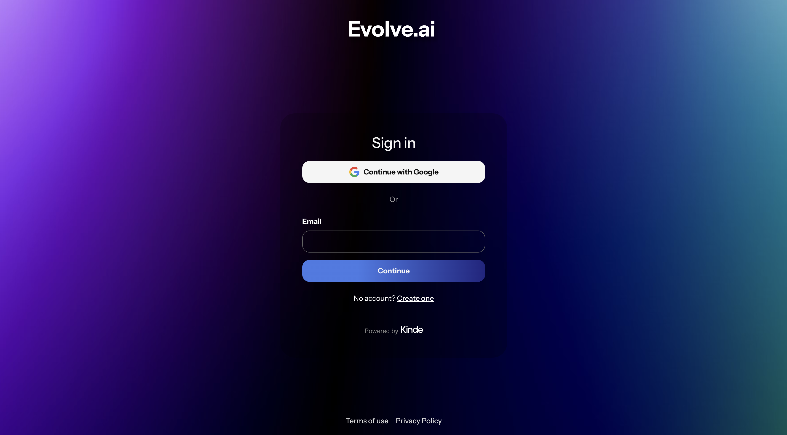

# 🤖 Evolve.ai - Kinde Custom UI Starter Template

A fully customizable UI starter template built with React Server Components and Kinde's Custom UI feature. Design your auth flows with complete control over the UI.

## Preview

View [live demo](https://evolveai.kindedemo.com/auth/cx/_:nav&m:login&psid:0194f24f2a4c79a57138aa68cec78ab4)



## Features

- 🎯 Full control over auth UI design and layout
- 🚀 Built with React Server Components
- 🔒 Kinde Authentication integration
- 📱 Responsive design out of the box

## Prerequisites

- npm or yarn
- A Kinde account with Custom UI feature enabled

## Quick Start

Given the mismatch between the current CLI and the repository, the **Quick Start** section should pivot to the "Git Sync" method. This is the most reliable way for users to get the template running without hitting command errors.

Here is the updated section for your README:

---

## Quick Start

The most efficient way to use the **Evolve Custom UI Starter Template** is through Kinde's **Git Sync** workflow. This allows you to manage your UI via GitHub and automatically sync changes to your Kinde admin.

### 1. Fork this Repository

Click the **Fork** button at the top of this page to create a copy of this template in your own GitHub account.

### 2. Connect to Kinde

1. Log in to your **Kinde Admin** panel.
2. Navigate to **Settings > Design > Custom UI**.
3. Select **Connect to GitHub**.
4. Choose your forked `custom-ui-evolve-ai` repository and follow the prompts to authorize the connection.

### 3. Local Development

To make changes locally, clone your fork and install the dependencies:

```bash
# Clone your fork
git clone https://github.com/YOUR_USERNAME/custom-ui-evolve-ai.git

# Navigate to the directory
cd custom-ui-evolve-ai

# Install dependencies
npm install

```

Once your changes are pushed to your `main` branch, Kinde will automatically detect apply the updates to your Custom UI and you can manage them and make the latest changes live via the UI.


## Customization Guide

### Page Layouts

The template includes customizable layouts for all authentication pages:

- Sign In
- Sign Up
- Password Reset
- Email Verification
- Multi-factor Authentication
- Social Authentication
- Error Pages
- And more...

Each layout can be customized in the `kindeSrc/enviroment/pages/(kinde)` directory.

## Project Structure

```
📂 splitScape
├── 📂 kindeSrc
│   └── 📂 environment
│       └── 📂 pages
│           ├── ⚛️ layout.tsx
│           ├── 📄 styles.ts
│           └── 📂 (kinde)
│               └── 📂 (default)
│                   └── ⚛️ page.tsx
└── 📄 kinde.json

```

## Contributing

We welcome contributions! Please feel free to submit a Pull Request.

1. Fork the project
2. Create your feature branch (`git checkout -b feature/AmazingFeature`)
3. Commit your changes (`git commit -m 'Add some AmazingFeature'`)
4. Push to the branch (`git push origin feature/AmazingFeature`)
5. Open a Pull Request

## License

This project is licensed under the MIT License - see the [LICENSE](LICENSE) file for details.

## Support

Need help? Here are some resources:

- Check out the [video demos](https://www.loom.com/share/folder/4398af02bbde4f498952ab4654a331a3) for implementation examples
- Join the [Kinde Community](https://community.kinde.com)
- Open an issue on GitHub
- Review the [Kinde documentation](https://docs.kinde.com)
